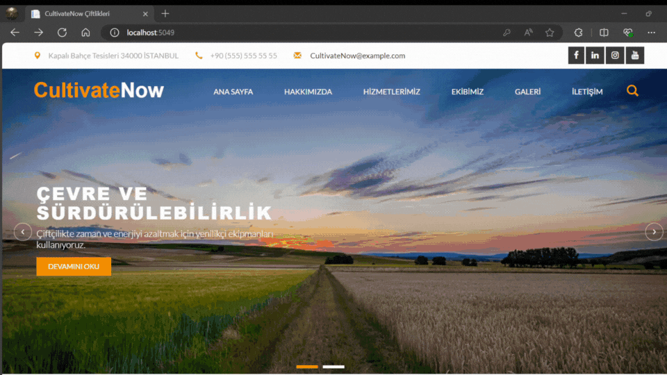

# CultivateNow

ASP.NET Core 8 ile geliştirdiğim admin panelli dinamik kurumsal çiftlik sitesi. 

Bu projede N katmanlı mimari üzerinde çalışmayı pekiştirmekle beraber şu yapıları kullanma şansı buldum: Asp.Net Core 8.0, Entity Framework Code-First, Generic Repository Pattern, SQL, Html, Css, Bootstrap, JavaScript, EPPlus Kütüphanesi, ClosedXML Kütüphanesi, FluentValidation Kütüphanesi

## CultivateNow Ana Sayfa

## CultivateNow Login ve Admin Panel

